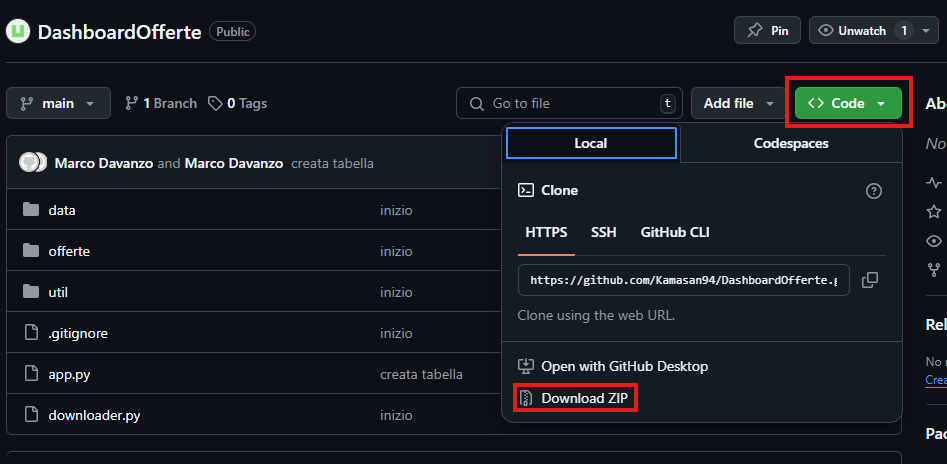

🛠 Installazione

1️⃣ Clona il repository

  git clone https://github.com/tuo-utente/flask-dash-offerte.git

  O da GitHub
  
  
  cd flask-dash-offerte

2️⃣ Crea un ambiente virtuale e installa le dipendenze

  python -m venv venv
  source venv/bin/activate  # Mac/Linux
  venv\Scripts\activate  # Windows
  pip install -r requirements.txt

3️⃣ Avvia l'applicazione

  python app.py

L'app sarà disponibile su http://127.0.0.1:8050